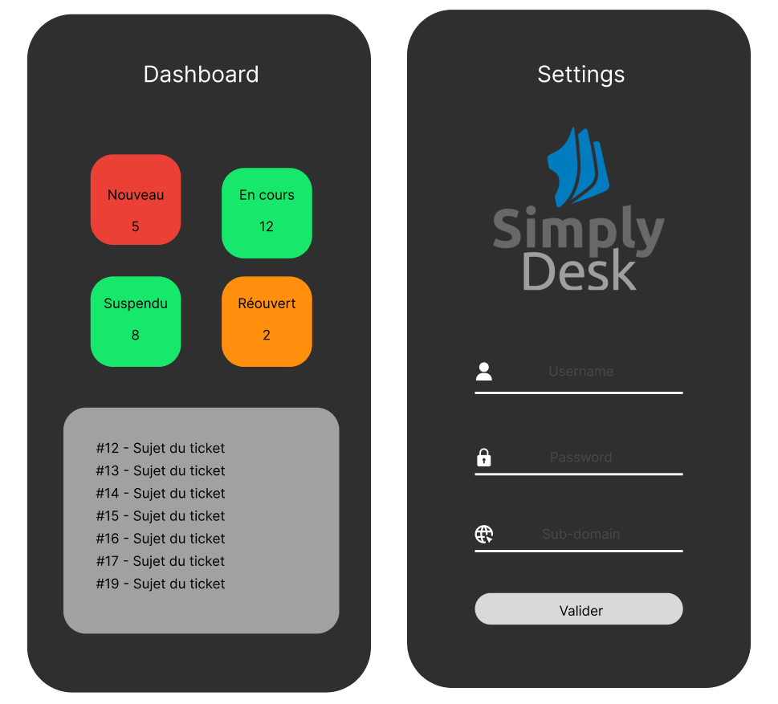

# Dashboard

C'est une application Dashboard permettant d'obtenir le nombre de ticket dans les états "Nouveau", "En Cours", "Suspendu" et "Réouvert" ainsi qu'obtenir la liste des nouveaux tickets et pouvoir obtenir plus de détails sur ces nouveaux tickets.

### Maquettes

### Design final

